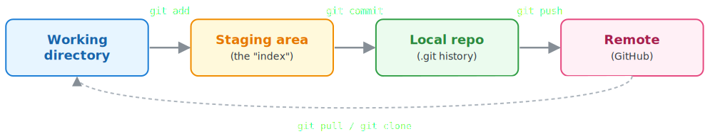
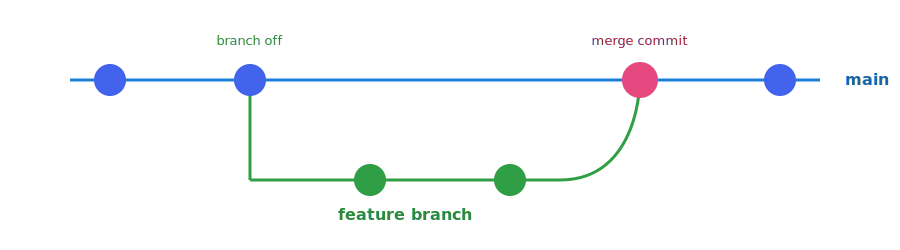
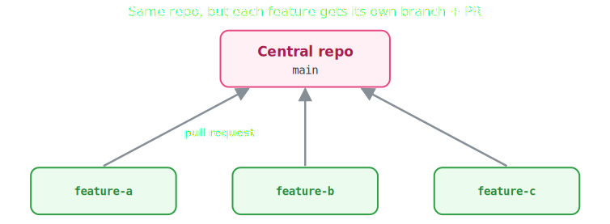
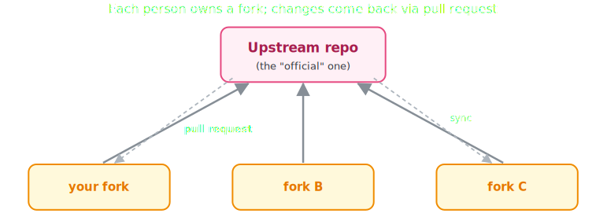
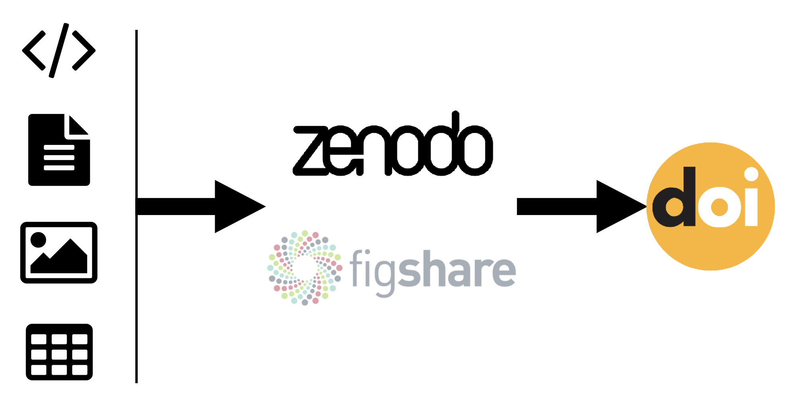
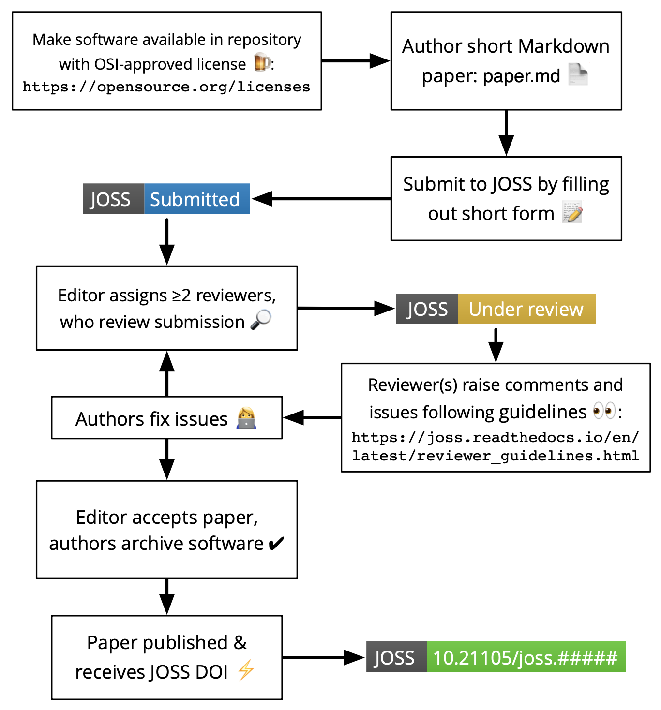

## URSSI Summer School Overview {.smaller}

- **URSSI:** U.S. Research Software Sustainability Institute
- This presentation is adapted from materials developed for the
[June 2026 URSSI Summer School](https://github.com/si2-urssi/summerschool-June2026)
  - *The workshop used* **Python** *for its examples and tools, but the principles*
  *here apply across languages*

## Presentation Goals {.smaller}

+ **Review best practices as presented by URSSI**
+ **Discuss agreement/disagreement**
+ **Discuss implementation in practice**

## Managing Environments {.smaller}

- Don't install packages into global environment
- Python:
  - Mac/Linux: use virtual environments 
    - options: **built-in venv**, virtualenv, uv
    - options that also handle packaging & production: hatch, poetry, pipenv
  - Windows/projects with non-python dependencies: use Anaconda
    - options: miniforge, pixi, micromamba

::: {.fragment .no-reveal}
::: {.callout-discussion}
Do you use one system for all projects, or select the best system for each
project?
:::
:::

## Software Design & Modularity {.smaller}

- Why modularity?
  1. **Understandability:** break code into small pieces that can be understood
    separately
  2. **Maintainability & Reuse:** make code easier to maintain, reuse, and
  extend
  3. **Adaptability:** design code that can accomodate future requirements and
  new uses

## Software Design & Modularity {.smaller}

- A modular codebase should be:
  1. **Decomposable:** broken into modules
  2. **Composable:** can be reused
  3. **Understandable:** each module alone
  4. **Continuous:** small requirement change affects few modules
  5. **Isolated:** error in one module does not affect others

::: {.fragment .no-reveal}
::: {.callout-discussion}
Which of these is hardest to achieve in your work?
:::
:::

## Software Design & Modularity {.smaller}

- Common design patterns to help achieve modularity:
  - Abstract Base Classes: define common interface
  - Factory Pattern: select appropriate implementation of common interface
  - Many others!
  - [Link to common python patterns](https://github.com/faif/python-patterns)

::: {.fragment .no-reveal}
::: {.callout-discussion}
What type of patterns do you reach for in your work?
:::
:::

## Structuring Python Packages {.smaller}

<div style="margin-top: 1.5em; margin-bottom: 0.5em">
```text
mypackage/                # the project folder
├── README.md
├── CITATION.cff
├── LICENSE.txt
├── pyproject.toml        # the one config file (packaging + tools)
└── src/
    └── mypackage/        # the package (importable)
        ├── __init.py__   # makes it a package; defines the public API
        └── module.py     # single .py file with definitions (functions, classes, ...)
```
</div>

- **TOML**: minimal configuration file format ([link](https://packaging.python.org/en/latest/guides/writing-pyproject-toml/))
  - plain text file of `key = value` settings grouped under `[section]` headers
  - easy for humans to read and machines to parse

::: {.fragment .no-reveal}
::: {.callout-discussion}
Have you made a python package? If so, did you use a .toml file?
:::
:::

## Building Python Packages {.smaller}

<div style="margin-top: 0; padding-top: 0;">

</div>

- **Building:** turning your human-readable source code into a tidy, installable bundle
  - a build **backend** (ex. `setuptools`) is the tool that *does* the building
  - a build **frontend** (ex. `pip` or `build`) is the tool *you run*, which calls the backend

::: {.fragment .no-reveal}
::: {.callout-discussion}
Which build backend have you used or do you recommend?
:::
:::

## Git Refresher {.smaller}



::: {.fragment .no-reveal}
Branching & Merging


:::

## Feature Branching Workflow {.smaller}

{width="100%"}

::: {.fragment .no-reveal}
<span>1. Create a branch → 2. Add commits → 3. Push it → 4. Open a pull request → 5. Discuss & merge</span>
:::

## Forking Workflow {.smaller}

{width="100%"}

- You don't need write access to the central repo — this is how most open-source contributions work

## Pull Requests {.smaller}


- Never send a pull request from `main`
- Github has a [command-line tool](https://cli.github.com/) (`gh`) for pull requests

::: {.fragment .no-reveal}
::: {.callout-discussion}
Which workflow (feature branching or forking) do you primarily use and why? Do you use Github's CLI?
:::
:::

## Participating in Code Review {.smaller}

*Common practices in open-source software development:*

:::: {.columns}
::: {.column width="50%"}

- **Contributor:**
  - Keep PR small and focused
  - Explain *what* changed and *why*
  - Include tests and documentation
  - Respond constructively to feedback
  - Revise the PR until ready to merge

:::
::: {.column width="50%"}

+ **Reviewer:**
  ([link to checklist](https://arfc.github.io/manual/guides/pull_requests)):
  - Understand the motivation
  - Check correctness and readability
  - Review tests and documentation
  - Consider the user experience
  - Give constructive feedback
  - Approve the PR when ready to merge

:::
::::

::: {.fragment .no-reveal}
::: {.callout-discussion}
Do you regularly participate in code review? What is practical in your work?
:::
:::

## Testing {.smaller}

:::: {.columns}

::: {.column width="55%"}

- *Why?* Tests ensure new changes don't break existing code and help guide
  refactoring by exposing the user experience
- Test expected behavior and edge cases at multiple levels:
  - **unit tests:** a single function or class in isolation
  - **integration tests:** multiple modules working together
  - **functional tests:** whole workflow from the user perspective
- Most tests should be **unit tests**
- **pytest** auto runs `test_*.py` files and `test_*` functions

:::

::: {.column width="45%"}

```text
my_project/
├── src/
│   └── my_project/
│       └── module_a.py
└── tests/
    └── test_module_a.py
```

<div style="margin-top: 1.5em">
```python
# tests/test_module_a.py

def test_mean():
    assert mean([1, 2, 3]) == 2
```
</div>

<div style="margin-top: 1em">
```text
$ pytest
======= 1 passed in 0.01s =======
```
</div>

::: {.fragment .no-reveal}
::: {.callout-discussion}
How do you verify your code is correct? Where does automated testing fit in to your projects?
:::
:::

:::
::::


## Linting/Formatting/Type Checking {.smaller}

- *What?*
  - **linting:** flags problems in code (unused variables, duplicate
    imports, etc.)
  - **formatting:** reformats code to a consistent style
  - **type checking:** verifies consistency with declared types

:::: {.columns}

::: {.column width="75%"}

- *How?*
  - **Pre-commit** runs configured checks automatically during `git commit`
  - Configure these checks in `.pre-commit-config.yaml`

:::

::: {.column width="25%"}

::: {.fragment .no-reveal}
<div style="margin-top: 1em; margin-bottom: 0.5em">
```yaml
repos:
  - repo: ...
    hooks:
      - id: ruff
      - id: black
      - id: mypy
```
</div>
:::

:::
::::

::: {.fragment .no-reveal}
::: {.callout-discussion}
Which of these do you use? Do you use pre-commit or run manually?
:::
:::

## Continuous Integration {.smaller}

- **CI:** automatically runs project checks whenever code changes are pushed
or proposed
  - Implement with **GitHub Actions:** which can automatically run tests,
  linting, formatting, and type checking on every push or pull request
  - Can also use to build documentation, measure percentage of code covered
  by tests, and deploy to PyPI for new releases

:::: {.columns}

::: {.column width="55%"}
- Add `.yml` file in `.github/workflows/` to trigger GitHub Actions
- GitHub Actions are free for public repos, some limits on private repos

::: {.fragment .no-reveal}
::: {.callout-discussion}
Do your repos have CI workflows? What tasks are most important to automate?
:::
:::

:::

::: {.column width="45%"}
<div style="margin-top: 0.5em">
```yaml
# .github/workflows/ci.yml
name: CI
on: [push, pull_request]
jobs:
  test:
    runs-on: ubuntu-latest
    steps:
      - uses: actions/checkout@v4
      - uses: actions/setup-python@v5
      - run: pip install -e .[dev]
      - run: pytest
```
</div>

:::
::::


## Documentation and Versioning {.smaller}

| Level	| Audience | Example |
|---|---|---|
| **Instructions**	| Anyone *arriving* at the repo	| `README.rst`, `INSTALL.md` |
| **API documentation**	| People *calling* your code	| docstrings → Sphinx site |
| **Self-documenting code**	| People *reading* your code	| [PEP 8](https://peps.python.org/pep-0008/) names |
| **Comments**	| People *editing* your code	| # why, not what |
| **User guides**	| Domain users	| Github Pages tutorials |
| **Versioning** | All of the above | `MAJOR.MINOR.PATCH` |

::: {.fragment .no-reveal}
::: {.callout-discussion}
Do you do all of the above? Which levels do you believe are the most time consuming or difficult?
:::
:::

## Software Licenses {.smaller}

- Terms by which others may use or modify your code
- Proprietary or Free/Open Source (FOSS, FLOSS, OSS)
  - FOSS categories: permissive and "copyleft"
    - Permissive: allow further distribution under any license (ex. BSD 3-clause, MIT)
    - Copyleft: require modifications to be shared under the same license ("viral") (ex. GPL)

::: {.fragment .no-reveal}
::: {.callout-discussion}
Which license do you typically use and why?
:::
:::

## Archiving Software {.smaller}

:::: {.columns}

::: {.column width="55%"}
- Recommended workflow:
  - `git tag -a v0.0.1 -m "version 0.0.1"`
  - `git push origin --tags`
  - Go to GitHub repo -> Releases -> v0.0.1
  - Create release from tag
  - Grab the DOI from Zenodo!
:::

::: {.column width="45%"}
{width="100%"}
:::

::::

## Reproducibility Packs {.smaller}

1. Produce a single repro-pack for an entire paper, which contains:
    - Plotting scripts and associated results data
    - Figures (PDFs for plots, always)
    - Any other relevant data: input files, configuration files, etc.
2. Upload to Figshare/Zenodo under CC-BY license
3. Cite using the resulting DOI in the associated paper(s)

::: {.fragment .no-reveal}
*Lets you reuse your figures without violating the journal copyright.*
:::

::: {.fragment .no-reveal}
::: {.callout-discussion}
Have you heard of repro-packs or do you already implement them?
:::
:::

## Journal of Open Science Software {.smaller}

:::: {.columns}

::: {.column width="50%"}
- Developer-friendly journal for research software packages
- Affiliate of Open Source Initiative
- Open access & no fees

::: {.fragment .no-reveal}
::: {.callout-discussion}
Would you consider publishing in JOSS?
:::
:::
:::

::: {.column width="50%"}
::: {.fragment .no-reveal}
{width="100%"}
:::
:::

::::

## Closing Discussion {.smaller}

+ **What do you agree with?**
+ **Disagree with?**
+ **What does implementation look like in practice?**

## Resources {.smaller}

- **[URSSI Summer School 2026](https://github.com/si2-urssi/summerschool-June2026)**
- [Scientific Python Library Development Guide](https://learn.scientific-python.org/development/)
- [`scientific-python/cookie`](https://github.com/scientific-python/cookie)
- [choosealicense.com](https://choosealicense.com/)
- [Open Source Initiative Approved Licenses](https://opensource.org/licenses)
- [Software Citation Principles](https://peerj.com/articles/cs-86/)
- [Link to common python patterns for modularity](https://github.com/faif/python-patterns)
- [Detailed PR reviewer checklist](https://arfc.github.io/manual/guides/pull_requests)
